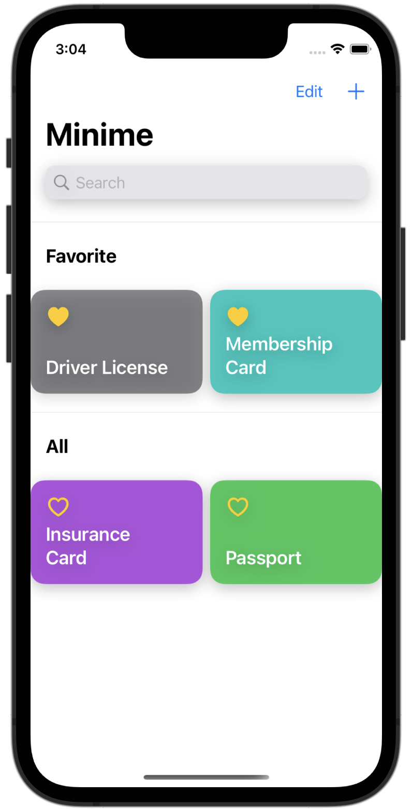

# minime
iOS Application that stores important documents - eliminating the need to carry for everyday use
 Developed by Peter Wi.

## Screenshots

|Name|Screenshots|Key Points
|--|--|--|
|[minime]||1.MVVM Pattern 2.Core Data 3.Face ID/TouchID/Passcode 4.Animation 5.Search Bar 6.Zoom In/Out
